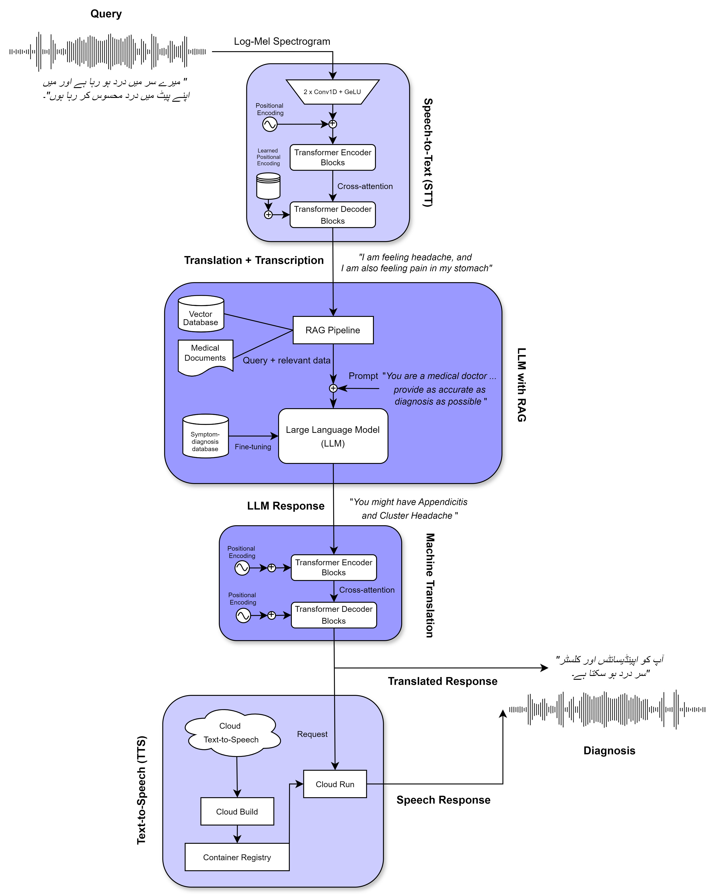
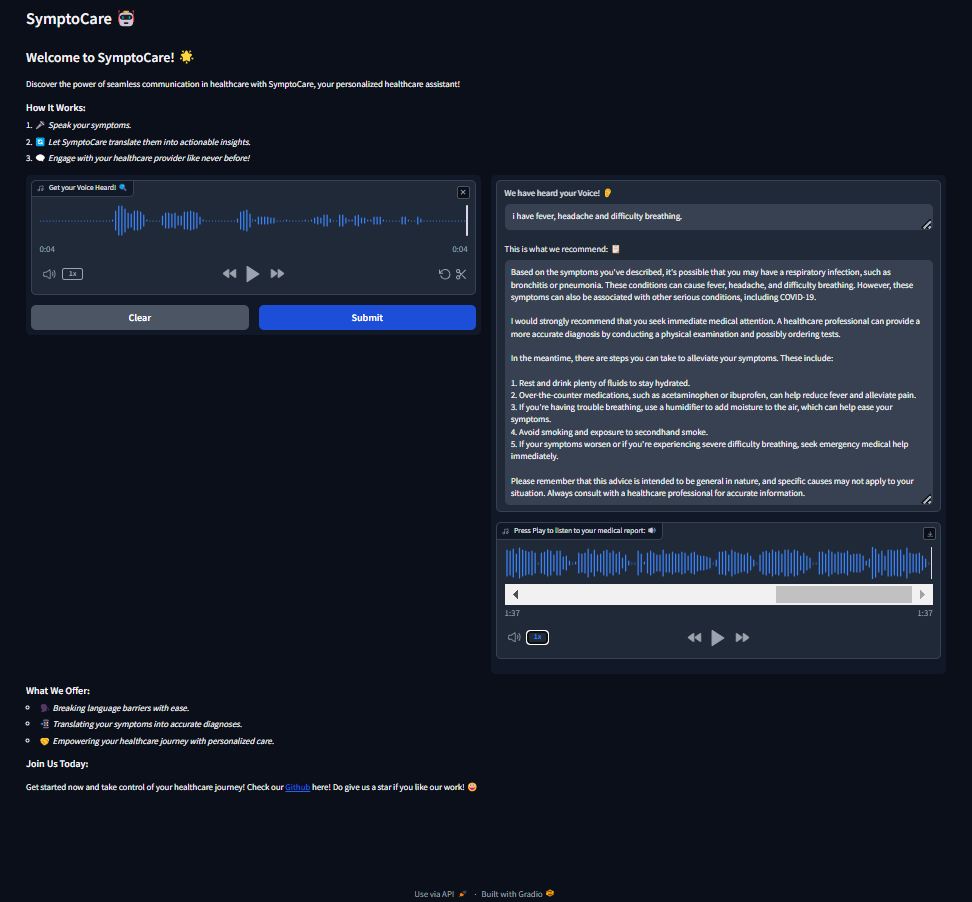

# SymptoCare: A Speech Recognition and Translation System For Medical Communication

This is our final project for the course *CS 5302 - Speech and Language Processing with Generative AI* offered in Spring 2024 at the Lahore University of Management Sciences. This project was supervised by the course instructor Dr. Agha Ali Raza (Associate Professor at the Department of Computer Science, LUMS).

## Introduction

Effective communication between patients and healthcare providers is vital for quality care, especially considering the diverse linguistic backgrounds of patients. This diversity poses challenges, potentially leading to adverse outcomes for refugees, immigrants, and those in underserved areas. Our proposed solution is an SMTS (Speech-to-Machine Translation + Speech) system, integrating speech recognition, machine translation, and text-to-speech technologies to bridge language gaps in healthcare. Development involves database selection, LLM fine-tuning, and RAG pipeline utilization, enabling real-time access to medical advice and information. We have chosen to call SymptoCare.

## System Design

SymptoCare can be broken down into the following blocks:

- **Audio Input**: The system receives a user's query in the form of an audio input.
- **Speech-to-Text (STT)**: The audio query is transcribed into English using [FasterWhisper](https://github.com/SYSTRAN/faster-whisper).
- **Large Language Model (LLM) Utilization**: A pre-trained LLM is employed to interpret the transcribed query. The model has been fine-tuned on Kaggle's [Disease-Symptom Dataset](https://www.kaggle.com/datasets/dhivyeshrk/diseases-and-symptoms-dataset) and [Disease Symptoms and Patient Profile Dataset](https://www.kaggle.com/datasets/uom190346a/disease-symptoms-and-patient-profile-dataset) to ensure it can provide medically accurate diagnoses in response to patient symptoms. For this purpose, we used [Mixtral-8x7B](https://huggingface.co/mistralai/Mixtral-8x7B-Instruct-v0.1). The LLM generates a text response in English based on the user's query. This response contains the expert diagnosis for the patient.
- **Machine Translation**: The English text response is translated into the user's preferred language by employing [MarianMT](https://huggingface.co/docs/transformers/en/model_doc/marian).
- **Text-to-Speech (TTS) Module**: The translated text is converted back into audio form with [Google Translate's text-to-speech API](https://pypi.org/project/gTTS/).
- **Audio Output**: An audio recording of the diagnosis in the patient's language is played back.

## User Instructions

You can access SymptoCare by running the [SMTS_deploy.ipynb](https://github.com/CS-5302/CS-5302-Project-Group-15/blob/main/SMTS_deploy.ipynb) notebook. You can also find a comprehensive step-by-step video guide on how to use the app by clicking [here](https://drive.google.com/file/d/1w0ozMUCpgf2rCODQ6N_CH3fSxCJ7v40s/view?usp=drive_link).

To gain a better understanding of how our GitHub repository works, click [here](https://drive.google.com/file/d/1GZwShpsGaDuEwNFpOqt5Xy85RCB7N1ZW/view?usp=drive_link) to watch another video guide.

To access the API keys and other project deliverables, you can visit this [Google Drive link](https://drive.google.com/drive/folders/1pFgekU6hQQG2GhDhlIHJMoj-ke3UdU_1). 

Here's what the final SymptoCare UI should look like:

